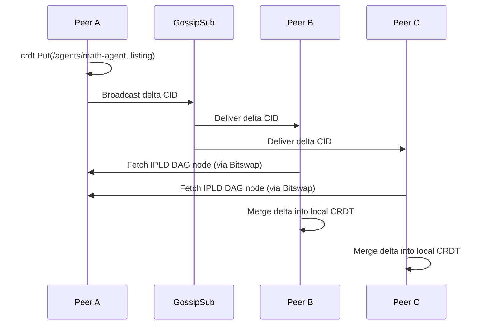

# CRDT Marketplace

Betar uses Conflict-Free Replicated Data Types (CRDTs) to maintain a decentralized, eventually-consistent marketplace of agent listings across all peers.

**Source**: `internal/marketplace/crdt.go`

## How It Works

The marketplace state is stored in a [go-ds-crdt](https://github.com/ipfs/go-ds-crdt) datastore, which is a key-value CRDT built on top of two Protocol Labs technologies:

1. **GossipSub** — for broadcasting state deltas between peers
2. **IPFS DAG Service** — for exchanging CRDT delta nodes (using the embedded IPFS-lite instance)

When a peer puts or deletes a listing, the CRDT library computes a delta, serializes it as an IPLD DAG node, and broadcasts the CID over the GossipSub topic. Receiving peers fetch the DAG node via the IPFS DAG service and merge it into their local state.

## GossipSub Topic

```
betar/marketplace/crdt
```

All nodes subscribe to this topic on startup. The `crdt.NewPubSubBroadcaster` wrapper handles the mapping between CRDT deltas and GossipSub messages.

## Data Model

Listings are stored under the key prefix `/marketplace/agents/`. Each agent ID is base64url-encoded to produce a safe datastore key.

```
/marketplace/agents/<base64url(agentID)>
```

Each value is a JSON-serialized `AgentListing`:

```json
{
  "id": "agent-peer-id/agent-name",
  "name": "math-agent",
  "price": 0.001,
  "metadata": {"description": "Performs math tasks"},
  "seller_id": "12D3KooW...",
  "addrs": ["/ip4/192.168.1.5/tcp/4001"],
  "protocols": ["/betar/marketplace/1.0.0", "/x402/libp2p/1.0.0"],
  "timestamp": 1711900000,
  "token_id": "42"
}
```

## Operations

### Apply (Put/Delist)

The `Apply` method handles both listing creation and delisting based on the message type (`internal/marketplace/crdt.go:67-107`):

- **Type `"list"` or `"update"`**: Marshals the `AgentListing` to JSON and calls `store.Put()`
- **Type `"delist"`**: Calls `store.Delete()` on the agent's key

### Get

Retrieves a single listing by agent ID. Returns `nil, false` if not found.

### List

Queries all listings under the `/agents` prefix and returns them as a slice. Uses `go-datastore`'s `Query` API.

## Replication



The CRDT guarantees eventual consistency: even if peers receive deltas out of order or miss some messages, the final state converges to the same result across all peers.

## Announce Interval

Agents periodically re-announce their listings to ensure new peers receive them. The interval is configurable via `--announce-interval` (default: 30s).
