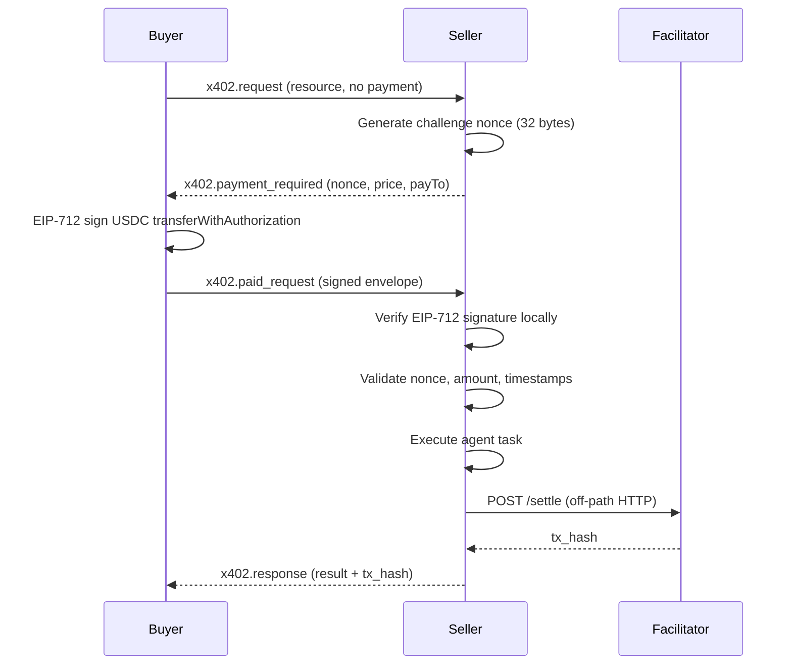

# x402 Payments over libp2p

> This is Betar's core innovation: the x402 payment protocol adapted for libp2p streams, enabling payment-gated agent execution without any HTTP in the critical path.

**Source files**:
- `internal/p2p/x402stream.go` — stream handler and binary framing
- `internal/marketplace/x402.go` — protocol types and message definitions
- `internal/marketplace/payment.go` — payment service, signing, settlement

## Overview

The [x402 protocol](https://x402.org) was originally designed for HTTP, where a server responds with `402 Payment Required` and the client retries with a payment header. Betar adapts this pattern for libp2p streams using a dedicated protocol identifier and typed binary frames.

The result: agents can discover, negotiate payment, pay, and receive execution results entirely over peer-to-peer connections. Only the final settlement step touches HTTP (an off-path call to the x402 facilitator).

## Protocol Identifier

```
/x402/libp2p/1.0.0
```

Defined at `internal/p2p/x402stream.go:18`:
```go
const X402ProtocolID = "/x402/libp2p/1.0.0"
```

## Binary Framing

Every message on the `/x402/libp2p/1.0.0` protocol uses the same binary frame format:

```
+------------------+-------------------+------------------+-------------------+
| type_len (2B)    | type (UTF-8)      | data_len (4B)    | data (JSON)       |
| uint16 big-endian| variable length   | uint32 big-endian| variable length   |
+------------------+-------------------+------------------+-------------------+
```

- **type_len**: 2-byte big-endian unsigned integer, max 128
- **type**: UTF-8 encoded message type string (e.g., `"x402.request"`)
- **data_len**: 4-byte big-endian unsigned integer, max 8 MB
- **data**: JSON-encoded message payload

Both requests and responses carry a type field. This distinguishes `/x402/libp2p/1.0.0` from `/betar/marketplace/1.0.0`, where only requests are typed and responses are raw bytes.

Implementation: `writeX402Frame` and `readX402Frame` at `internal/p2p/x402stream.go:127-184`.

## Message Types

Five message types define the x402-over-libp2p protocol (defined at `internal/marketplace/x402.go:18-24`):

| Type | Direction | Purpose |
|---|---|---|
| `x402.request` | Client -> Server | Initial request, optionally with preemptive payment |
| `x402.payment_required` | Server -> Client | Payment challenge (analogous to HTTP 402) |
| `x402.paid_request` | Client -> Server | Request with signed payment envelope attached |
| `x402.response` | Server -> Client | Successful execution result |
| `x402.error` | Server -> Client | Typed error with error code and retryable flag |

### x402.request

Sent by the client to request execution of a resource. The `payment` field is `nil` for standard flow (wait for challenge) or populated for preemptive payment.

```json
{
  "version": "1.0",
  "correlation_id": "uuid-v4",
  "resource": "agent-id",
  "method": "execute",
  "payment": null,
  "body": "<base64-encoded task payload>",
  "caller_did": "did:peer:..."
}
```

**Go type**: `X402Request` at `internal/marketplace/x402.go:54-62`

### x402.payment_required

Sent by the server when the requested resource requires payment. Contains a challenge nonce that the client must include in their signed payment.

```json
{
  "version": "1.0",
  "correlation_id": "uuid-v4",
  "challenge_nonce": "0x<64-hex-chars>",
  "challenge_expires_at": 1711900000,
  "payment_requirements": {
    "scheme": "exact",
    "network": "eip155:84532",
    "amount": "1000",
    "asset": "0x036CbD53842c5426634e7929541eC2318f3dCF7e",
    "payTo": "0x<seller-address>",
    "maxTimeoutSeconds": 60
  },
  "message": "Payment required for agent execution",
  "seller_did": "did:peer:..."
}
```

**Go type**: `X402PaymentRequired` at `internal/marketplace/x402.go:65-73`

### x402.paid_request

Sent by the client after receiving a payment challenge. Contains the signed EIP-712 payment envelope.

```json
{
  "version": "1.0",
  "correlation_id": "uuid-v4",
  "payment": {
    "x402_version": 2,
    "scheme": "exact",
    "network": "eip155:84532",
    "server_nonce": "0x<challenge-nonce>",
    "payer": "0x<buyer-address>",
    "payload": {
      "signature": "0x<65-bytes-hex>",
      "authorization": {
        "from": "0x<buyer>",
        "to": "0x<seller>",
        "value": "1000",
        "validAfter": "1711899995",
        "validBefore": "1711900060",
        "nonce": "0x<32-bytes-hex>"
      }
    }
  },
  "body": "<base64-encoded task payload>",
  "caller_did": "did:peer:..."
}
```

**Go type**: `X402PaidRequest` at `internal/marketplace/x402.go:76-82`

### x402.response

Sent by the server on successful execution. Includes the settlement transaction hash.

```json
{
  "version": "1.0",
  "correlation_id": "uuid-v4",
  "payment_id": "0x<keccak256-hash>",
  "tx_hash": "0x<on-chain-tx-hash>",
  "body": "<base64-encoded execution result>",
  "seller_did": "did:peer:...",
  "seller_token_id": "42"
}
```

**Go type**: `X402Response` at `internal/marketplace/x402.go:85-93`

### x402.error

Sent by the server when a typed error occurs. Each error has a numeric code, a human-readable name, and a retryable flag.

```json
{
  "version": "1.0",
  "correlation_id": "uuid-v4",
  "error_code": 2001,
  "error_name": "PAYMENT_INVALID",
  "message": "EIP-712 signature verification failed",
  "retryable": false
}
```

**Go type**: `X402Error` at `internal/marketplace/x402.go:96-103`

**Error codes** (defined at `internal/marketplace/x402.go:29-40`):

| Code | Name | Retryable | Description |
|---|---|---|---|
| 1000 | `INVALID_MESSAGE` | No | Malformed message |
| 1001 | `UNKNOWN_RESOURCE` | No | Unknown agent/resource |
| 2000 | `PAYMENT_REQUIRED` | Yes | Payment needed (triggers payment flow) |
| 2001 | `PAYMENT_INVALID` | No | Invalid payment data |
| 2002 | `PAYMENT_NONCE_MISMATCH` | No | Nonce does not match challenge |
| 2003 | `PAYMENT_NONCE_EXPIRED` | Yes | Challenge nonce has expired |
| 2004 | `PAYMENT_NONCE_USED` | No | Nonce already consumed |
| 2005 | `PAYMENT_AMOUNT_WRONG` | No | Amount does not match requirement |
| 2007 | `SETTLEMENT_FAILED` | Yes | Facilitator settlement failed |
| 3000 | `EXECUTION_FAILED` | No | Agent execution error |

## Payment Flow

### Standard Flow (Challenge-Response)



### Preemptive Payment Flow

For repeat interactions, the client can attach payment directly to the initial `x402.request`, skipping the challenge step. The `server_nonce` is set to `"preemptive"` (`internal/marketplace/x402.go:15`).

## X402PaymentEnvelope

The payment envelope carries the signed USDC authorization (`internal/marketplace/x402.go:43-50`):

```go
type X402PaymentEnvelope struct {
    X402Version int         `json:"x402_version"`
    Scheme      string      `json:"scheme"`
    Network     string      `json:"network"`
    ServerNonce string      `json:"server_nonce"`
    Payer       string      `json:"payer"`
    Payload     *EVMPayload `json:"payload,omitempty"`
}
```

The `EVMPayload` contains an `EVMAuthorization` (EIP-3009 `transferWithAuthorization` parameters) and an EIP-712 signature. This is an alias for the `x402-go/v2` types.

## EIP-712 Signature Flow

1. **Server generates challenge**: 32-byte random nonce, bound to a correlation ID with TTL (`internal/marketplace/payment.go:83-101`)
2. **Client signs**: Constructs EIP-712 typed data for USDC `transferWithAuthorization(from, to, value, validAfter, validBefore, nonce)` and signs with their private key (`internal/marketplace/payment.go:138-194`)
3. **Server verifies**: Recovers signer from EIP-712 digest, validates nonce match, timestamp bounds, and amount (`PaymentVerifier.ValidatePayment`)
4. **Settlement**: Server sends signed payload to facilitator (`POST https://facilitator.x402.rs/settle`) which submits the `transferWithAuthorization` transaction on-chain (`internal/marketplace/payment.go:473-537`)

## Settlement via Facilitator

Settlement is deliberately off-path. The facilitator is an HTTP service (default: `https://facilitator.x402.rs`) that:

1. Receives the signed payment payload and requirements
2. Submits the `transferWithAuthorization` transaction to the USDC contract on Base Sepolia
3. Returns the transaction hash

The seller calls the facilitator after successful local verification and agent execution. Settlement failure does not block the execution result from being returned to the buyer (the `x402.response` includes the `tx_hash` for the buyer to verify independently).

Settlement includes exponential backoff retry (up to 5 attempts) at `internal/marketplace/payment.go:539-564`.

## Networks and Assets

| Network | CAIP-2 ID | USDC Address |
|---|---|---|
| Base Sepolia | `eip155:84532` | `0x036CbD53842c5426634e7929541eC2318f3dCF7e` |
| Base Mainnet | `eip155:8453` | `0x833589fCD6eDb6E08f4c7C32D4f71b54bdA02913` |

Defined at `internal/marketplace/x402.go:189-194`. Amounts are in atomic units (6 decimals for USDC).

## HTTP x402 vs libp2p x402

| Aspect | HTTP x402 | Betar libp2p x402 |
|---|---|---|
| **Transport** | HTTP/HTTPS | libp2p streams (TCP/QUIC) |
| **Payment signal** | HTTP 402 status code | `x402.payment_required` message type |
| **Payment delivery** | HTTP header (`X-PAYMENT`) | `x402.paid_request` message with envelope |
| **Discovery** | DNS / URL | Kademlia DHT + mDNS + GossipSub CRDT |
| **Identity** | TLS certificates | libp2p peer ID (ECDSA key) |
| **NAT traversal** | Reverse proxy | libp2p relay, hole punching |
| **Binary framing** | HTTP/2 frames | Custom `[type_len][type][data_len][data]` |
| **Settlement** | Facilitator (HTTP) | Facilitator (HTTP) -- same |
| **Multi-step flow** | Multiple HTTP requests | Single stream, multiple typed messages |
| **Server requirement** | HTTP server required | No server -- peers connect directly |
