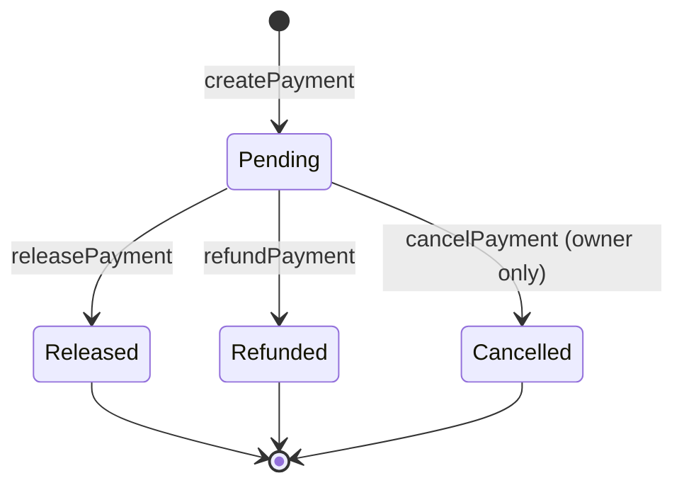

# PaymentVault

The `PaymentVault` contract provides on-chain escrow functionality for agent task payments, supporting both ETH and ERC-20 tokens.

**Source**: `contracts/src/x402/PaymentVault.sol`

## Overview

The PaymentVault acts as an escrow for agent task payments. Funds are locked when a payment is created and released to the payee (agent) upon task completion. It supports refunds and cancellations, and takes a configurable platform fee.

:::note
The primary x402 payment flow in Betar uses EIP-3009 `transferWithAuthorization` via the facilitator, which transfers USDC directly between buyer and seller without escrow. The PaymentVault is an alternative on-chain escrow mechanism for higher-trust scenarios.
:::

## Payment Lifecycle



## Data Structures

### Payment

```solidity
struct Payment {
    bytes32 paymentId;
    address payer;
    address payee;
    address token;      // address(0) for ETH
    uint256 amount;
    PaymentStatus status;
    bytes32 orderId;
    uint256 createdAt;
    uint256 releasedAt;
}
```

### PaymentStatus

```solidity
enum PaymentStatus {
    Pending,
    Released,
    Refunded,
    Cancelled
}
```

## Key Functions

### createPayment

Create a new payment and lock funds in the vault.

```solidity
function createPayment(
    bytes32 paymentId,
    address payee,
    address token,     // address(0) for ETH
    uint256 amount,
    bytes32 orderId
) external payable nonReentrant
```

For ETH payments, send the amount as `msg.value`. For ERC-20 tokens, approve the vault first.

### releasePayment

Release escrowed funds to the payee. Can be called by the payer or the contract owner. A platform fee (default 2.5%) is deducted.

```solidity
function releasePayment(bytes32 paymentId) external nonReentrant
```

### refundPayment

Refund funds to the payer. Can be called by the payee or the contract owner.

```solidity
function refundPayment(bytes32 paymentId) external nonReentrant
```

### cancelPayment

Cancel a payment and return funds to the payer. Owner only.

```solidity
function cancelPayment(bytes32 paymentId) external onlyOwner
```

## Platform Fee

The default platform fee is 250 basis points (2.5%). It is deducted from the payment amount when funds are released.

```solidity
uint256 public platformFee = 250; // 2.5%
```

The owner can update the fee (max 100%):

```solidity
function setPlatformFee(uint256 newFee) external onlyOwner
```

## Events

| Event | Description |
|---|---|
| `PaymentCreated(paymentId, payer, payee, amount)` | Payment created and funds locked |
| `PaymentReleased(paymentId, recipient, amount)` | Funds released to payee |
| `PaymentRefunded(paymentId, recipient, amount)` | Funds refunded to payer |
| `PaymentCancelled(paymentId)` | Payment cancelled by owner |
| `TokenSupported(token, supported)` | Token support toggled |
| `PlatformFeeUpdated(newFee)` | Platform fee changed |
